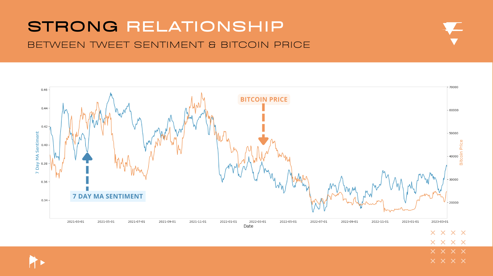
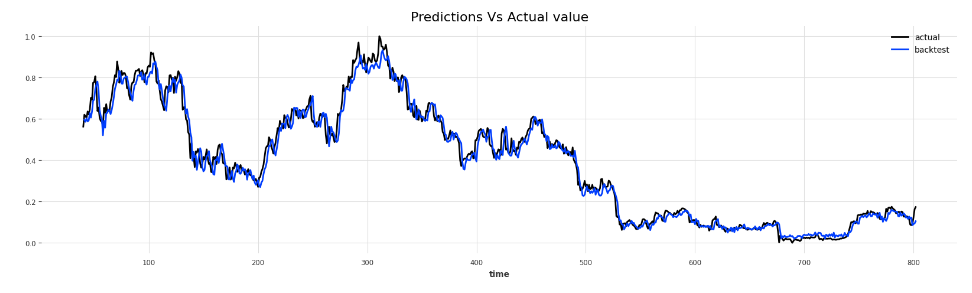
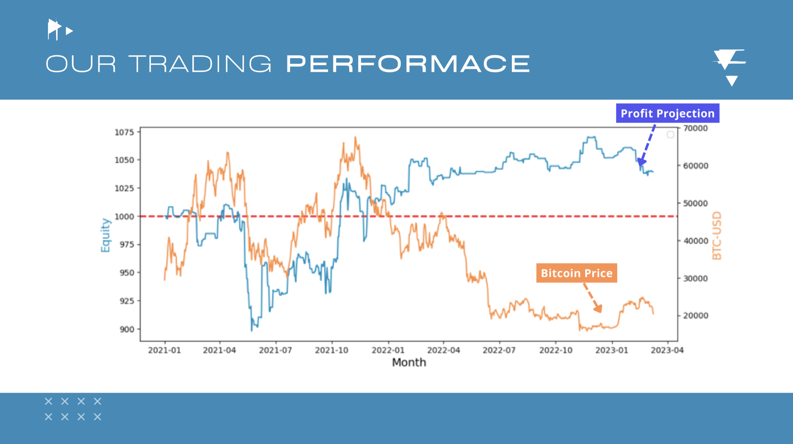
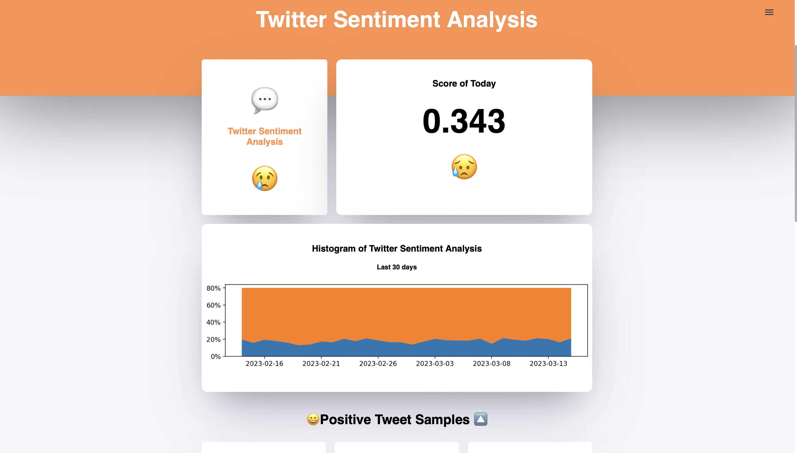
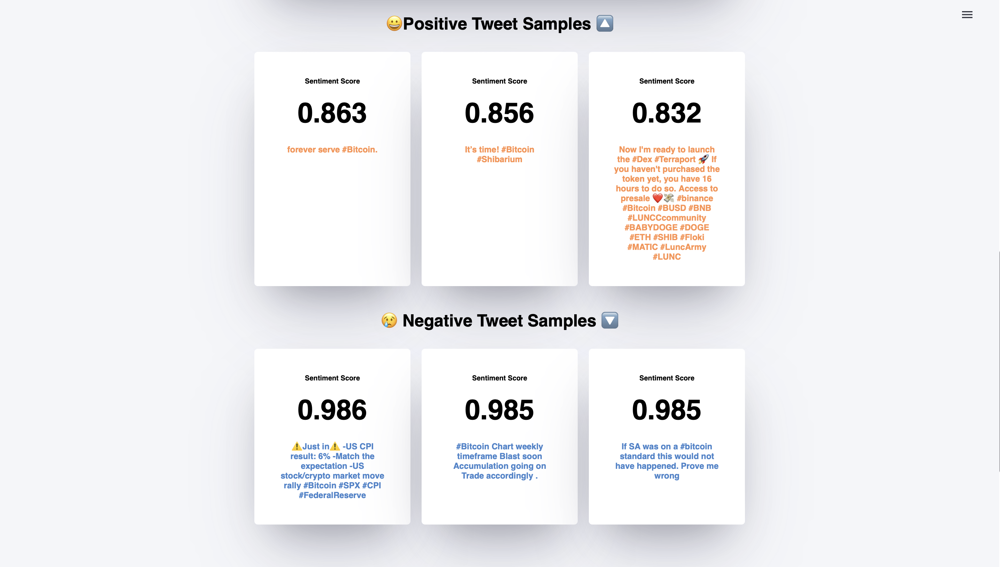
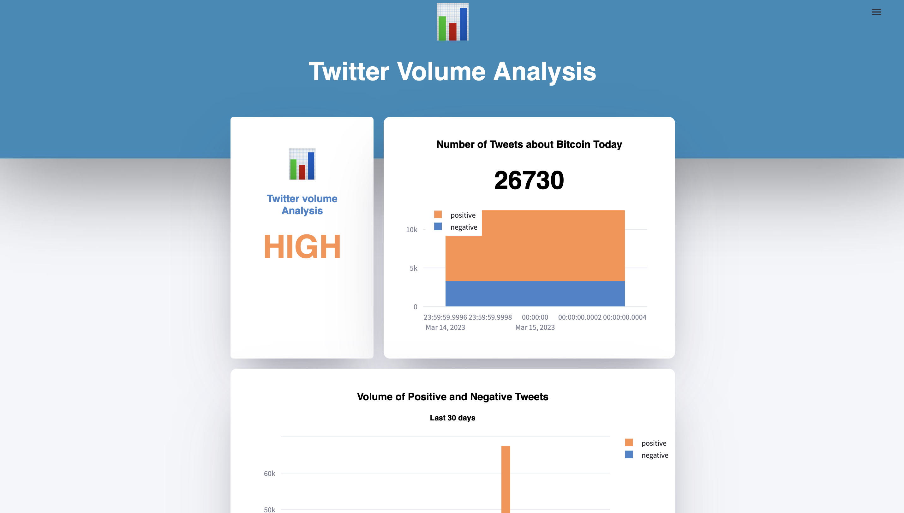
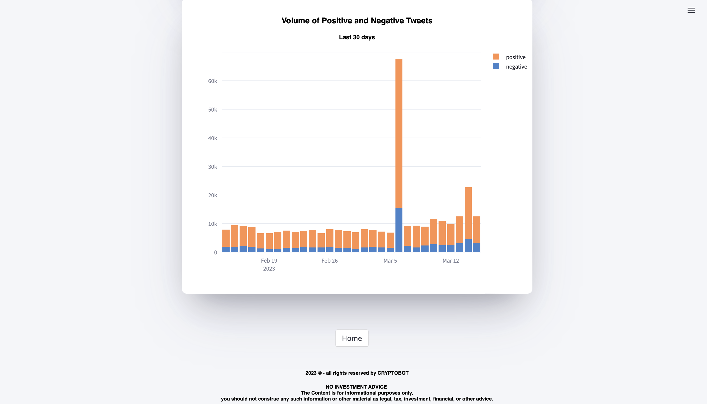
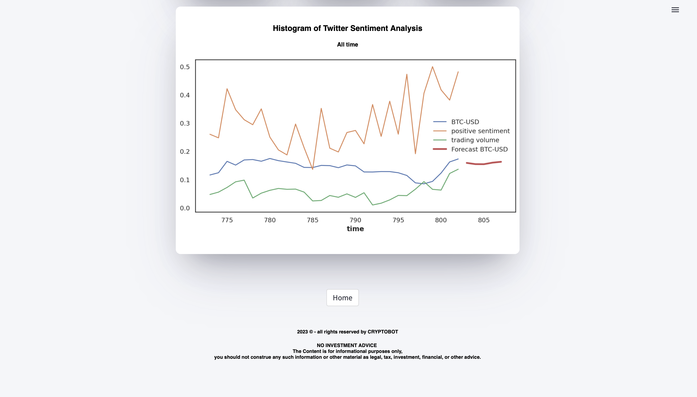

# cryptobot
## Motivation for project:
#### Cryptocurrency markets are notoriously volatile, yet lucrative. Since the vast majority of cryptocurrencies are not based on any tangible assets, their value is strongly correlated to public opinion and confidence. We analysed tweets over a 3 year period and found a high correlation with bitcoin fluctuations over this time.
## Relationship between Bitcoin price and Twitter sentiment

##### MA sentiment is the moving average of sentiment over 7 days. This was used to reduce the effect of noise on the results so a pattern could be more clearly seen.
## Overview:
#### Cryptobot used a preexisting natural language processing (NLP) model to get a sentiment rating of Tweets, on a daily basis, over a 2.5 year period. This data showed that tweet sentiment does indeed have a bearing on the price of Bitcoin. A time series was generated, using our Tweet sentiment data and other key data. We were able to generate 2 day predications with a mean average percentage error (MAPE) of 4.5%. Volume of Bitcoin tweets was also examined and used as a measure of how significant the sentiment rating for a given day was. Data engineering was used to provide realtime updates on Streamlit.
### Project Architecture:

## Time series analysis:
#### The time series was generated using the previous price of Bitcoin, as well as other exogenous variables. The previous price of Bitcoin was not enough to provide a useful time series model, due to its chaotic and volatile nature. However, when combined with our data about Bitcoin sentiment, the time series model improved significantly. When provided with data about Bitcoin trading volume, the time series improved even more, resulting in a MAPE of 4.5%. The backtested graph which shows the true values VS the predicted values can be seen below.

## 
## Trading strategy:
#### Combing the sentiment data we produced with a strategy proposed by Imperial College London (linked in the paper below *), our strategy made a profit, despite the fact that Bitcoin made a significant loss during the period we investigated. We considered this a huge success for our team.
#### * https://www.imperial.ac.uk/media/imperial-college/faculty-of-natural-sciences/department-of-mathematics/math-finance/TSOULIAS-KONSTANTINOS_02007404.pdf

## Demo :thumbsup:
#### Landing page for the site.

#### Homepage for site.

#### Twitter sentiment analysis. Score of today is between 0 and 1, 0 being not positive at all, 1 being perfectly positive. The histogram shows sentiment for the last 30 days, with the blue representing the negative sentiment and the orange representing the positive sentiment.

#### Some example of positive and negative tweets from our model. The rating shown for the positive tweets is a rating of positive sentiment from 0 to 1, with 1 being perfectly positive. The rating shown for the negative tweets is a rating of negative sentiment from 0 to 1, with 1 being perfectly negative.

#### Data about volume of tweets can be seen on this page, the greater the volume the more significant the sentimentality rating is for a given day.

#### Very interestingly, a clear peak in Tweets about Bitcoin can be seen in the days leading up to the Silicon Valley Bank (SVB) crash. This could potentially represent a spike in public mistrust of financial institutions and therefore an increased interest in cryptocurrencies such as Bitcoin.For more information on SVB and cryptocurrencies, see link: https://www.politico.eu/article/crypto-help-bring-down-svb-silicon-valley-bank-ftx/.

#### The live-updating time series model reveals its highest and lowest forecast for the coming 5 days.

#### Bitcoin price was used, together with exogenous variables: Bitcoin Trading Volume and sentimentality rating to generate a forecast of Bitcoin price over the next 5 days.

